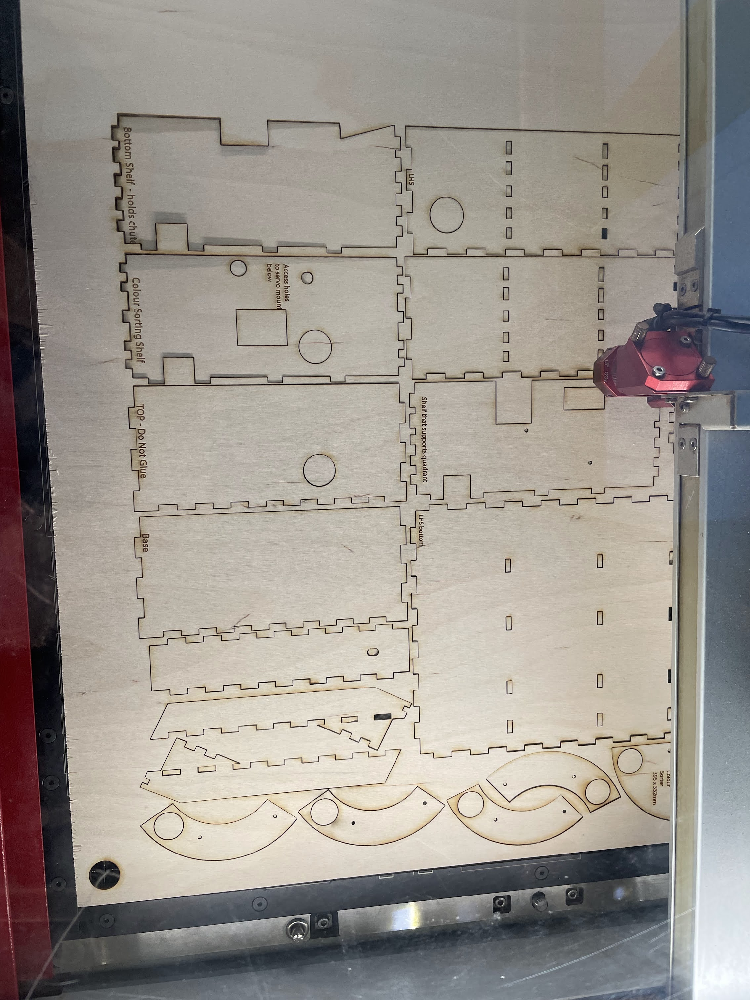
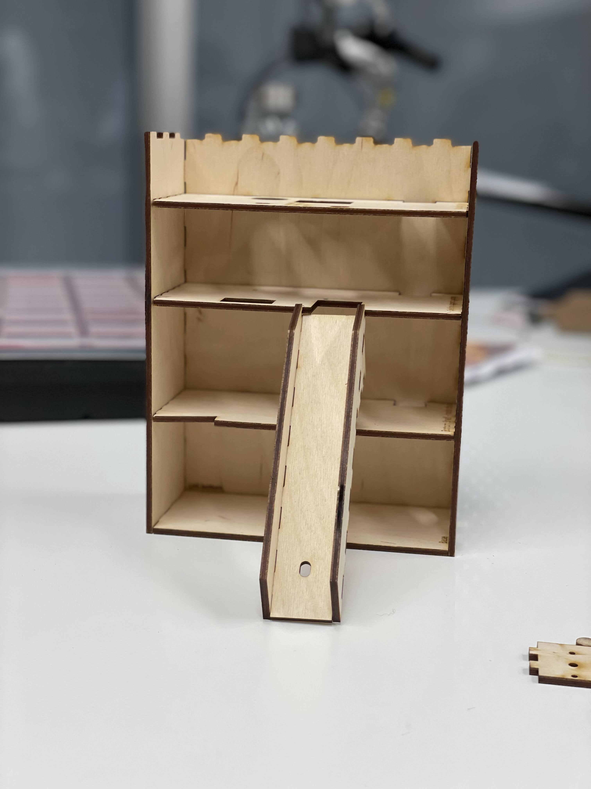

# Automatic Color Sorting Machine using RasperryPi and Servo Motor

#Introduction

Sorting of items is a difficult process to carry on manually, hence continuous sorting creates consistency issues. This project is a working prototype designed for automatic sorting of plastic lids based on the color. We used the computer vision to detect the colour and used OpenCv to implement the project. The identification of the colour is done by computer vision and the camera detects the colour. Two DC servo motors are being used , (1) to rotate to the hole and (2) to moving the item to the right container.  

The prototype of the design is created using an inspired existing template found. Reference attached at the end. We used the adobe illustrator and printed the design user lazer priter with 3mm wood. 

 
