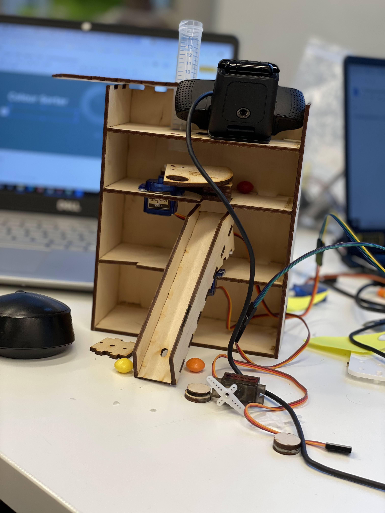

# Automatic Color Sorting Machine using RasperryPi and Servo Motor

## Introduction

Sorting of items is a difficult process to carry on manually, hence continuous sorting creates consistency issues. This project is a working prototype designed for automatic sorting of plastic lids based on the color. We used the computer vision to detect the colour and used OpenCv to implement the project. The identification of the colour is done by computer vision and the camera detects the colour. Two DC servo motors are being used , (1) to rotate to the hole and (2) to moving the item to the right container.  

## Requirement
Python 3.9
Linux, MacOS or Windows

## Components
Servo Motor - 2
Raspberry Pi
Raspberry Pi Camera or USB camera

### Libraries:
OpenCV

## Installation

Install the latest version of Raspberry Pi OS on your microSD card from here: https://www.raspberrypi.com/software/
Install VNC Viewer to be able to connect Raspberry Pi using the IP address
Open Raspberry Pi Configuration on your computer and enable a Raspberry Pi Camera.
Open a terminal on your computer and install OpenCV library, make sure you install dependencies according to the version https://raspberry-valley.azurewebsites.net/Updating-Raspberry-Pi/ 
Import GPIO library to be able to control the motors 

## Design 

Here you can download the 3D model, as well as, the drawings with all dimensions needed for building this project.https://howtomechatronics.com/projects/arduino-color-sorter-project/. 

## Design ProtoType

The prototype of the design is created using an inspired existing template found. Reference attached at the end. We used the adobe illustrator and printed the design user lazer priter with 3mm wood. 

  

